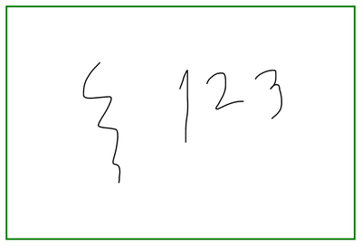
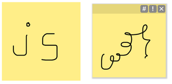

# scribby

_scribby_ is a javascript library which lets users draw simple "scribbles" on a web page.


## Objectives

* svg-based, smooth/natural drawing

* simple/intuitive (non-existent) interface

* json representation

* localStorage and (experimental) rest-based persistence

* lightweight, no dependencies


## Components

The main functionality is in **scribby.js**, which handles the drawing on an svg dom element.  Also included is **notey.js** which presents
a simple post-it note-like object on a webpage, as an example application using scribby.js.  Utility functionality is found in draggy.js and resty.js.

## Usage examples

Using _scribby_ to enable drawing on an svg element:

```javascript
var svgEl = document.getElementById('svg');
var scr = new Scribby(svgEl);
```


Using _notey_ to put a note on a page (which uses _scribby_ for its contents):

```javascript
var note = new Notey();
note.attachToBody();
note.save();
```



Typical json representation of a _note_:

```json
{
    "id": "7654b53b-a087-45f7-8163-46e96081fca7",
    "version": "1.0b",
    "dateCreated": "2020-06-14T08:19:04.927Z",
    "dateModified": "2020-06-14T08:19:11.316Z",
    "dateSaved": "2020-06-14T08:19:11.316Z",
    "dateSynced": "2020-06-14T08:19:04.930Z",
    "bgColorId": 1,
    "bgColor": "#FE8",
    "strokeColorId": 0,
    "strokeColor": "#000",
    "width": 167,
    "height": 167,
    "x": 876,
    "y": 353,
    "scribby": {
        "version": "1.0b",
        "dateCreated": "2020-06-14T08:19:04.928Z",
        "dateModified": "2020-06-14T08:19:11.316Z",
        "svg": {
            "width": 167,
            "height": 167,
            "content": "<path fill=\"none\" stroke=\"#000\" stroke-width=\"2\" stroke-linecap=\"round\" d=\"M57 69 L56.66 69 L56.2 69 [...] 135.75 L98.87 136.87 L98.37 137.87 L97.87 138.87 L97.37 139.75 L96.87 140.62 L96.5 141.5 L96.16 142.5 L96 143.5 L96 144.5\"></path>"
        },
        "strokeWidth": 2,
        "bufferSize": 8
    }
}
```

## Demo

(soon)

## Future development

Possible features and improvements.... though these may go against the objective of simplified usage!

* (multi-)touch & pressure support
* better configuration via constructor
* generalize (or plugin?) rest support
* scaling / re-sizing
* undo / eraser
* sharing
* export (svg download)
* multi-user (as "layers")

